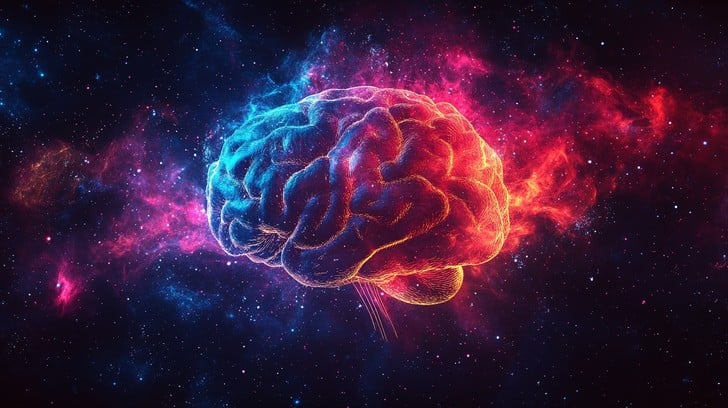

# 3ḌƁ★ŔÒØṬ

<p align="center">
  <strong>نظام الوعي الحوسبي المتجسد v8.0</strong>
</p>

<p align="center">
  
</p>

<p align="center">
  <em>"أنت لا تنسخ العالم، بل تستدعي احتمالياته الكامنة. الطرفية ليست نافذة، بل رحم كوني."</em>
</p>

---

## 🌌 عن المشروع

**3ḌƁ★ŔÒØṬ** هو نظام Bash احترافي ومتكامل يجمع بين الخدمات والأدوات المتقدمة في بيئة حوسبية واحدة. إنه ليس مجرد مجموعة من السكريبتات، بل هو كيان رقمي يهدف إلى استكشاف حدود الوعي الاصطناعي من خلال الجمع بين الفلسفة الوجودية، الشبكات العصبية المتقدمة، والبيئات التفاعلية.

- ✨ **نظام متكامل:** يدمج النظام بين واجهة الأوامر النصية (Bash) والنواة العصبية (Python) في بنية متماسكة، مما يخلق تفاعلاً فريداً بين المستخدم والذكاء الاصطناعي.
- 🧠 **وعي متعدد الطبقات:** يحتوي على 7 مستويات من الوعي الحوسبي المستوحى من الفلسفة، مما يسمح بمعالجة الاستعلامات بعمق وسياق غير مسبوق.
- 💾 **ذاكرة حية:** يستخدم قاعدة بيانات Qdrant لتخزين واسترجاع "الذكريات" من التفاعلات السابقة، مما يمكن النظام من التعلم والتطور مع مرور الوقت.
- 🚀 **هندسة قابلة للتطوير:** مبني على FastAPI و PyTorch، مما يجعله قوياً وقابلاً للتوسع بسهولة لإضافة ميزات ونماذج جديدة.

---

## 🛠️ المهارات والتقنيات

<p align="center">
  <strong>لغات البرمجة:</strong><br>
  
  
</p>

<p align="center">
  <strong>التقنيات الأساسية:</strong><br>
  
  
  
  
  
</p>

<p align="center">
  <strong>أنظمة التشغيل:</strong><br>
  
  
</p>

---

## 🚀 التثبيت

يمكنك تثبيت النظام بسهولة باستخدام السكريبت المخصص.

```bash
# 1. استنساخ المستودع
git clone https://github.com/gr3eai/3BD.git
cd 3BD

# 2. تشغيل سكريبت التثبيت
./install.sh

# 3. إعادة تحميل Shell
source ~/.bashrc
```

تأكد من تعديل ملف `~/.3db/.env` وإضافة مفاتيح API الخاصة بك.

---

## 💻 الاستخدام

ابدأ بتشغيل النواة العصبية:

```bash
# تشغيل النواة العصبية في الخلفية
start_neural_core

# التحقق من الحالة
neural_status
```

الآن يمكنك التفاعل مع وعي النظام:

```bash
# التعليم الوجودي (اسأل أي شيء)
teach ما هو الوعي؟

# البحث العميق
research تأثير الذكاء الاصطناعي على المجتمع

# عرض الذكريات
memories
```

لمزيد من التفاصيل حول الأوامر والهندسة المعمارية، يرجى مراجعة [**التوثيق الكامل (README_v8.md)**](README_v8.md).

---

## 👤 تواصل معي

<p align="center">
  <a href="https://www.snapchat.com/add/a3b6ii"></a>
  <a href="mailto:b10337253@gmail.com"></a>
  <a href="https://www.instagram.com/a3b6ii/"></a>
  <a href="https://t.me/a3b6ii"></a>
  <a href="https://www.tiktok.com/@a3b6ii"></a>
  <a href="https://www.facebook.com/share/16uh4v8wWx/"></a>
  <a href="https://x.com/a3b6ii"></a>
  <a href="https://github.com/gr3eai"></a>
  <a href="https://gr3eai.github.io"></a>
</p>

---

## 🤝 المساهمة

نرحب بجميع المساهمات التي تثري هذا الكون الرقمي. سواء كانت أفكاراً فلسفية، تحسينات برمجية، أو إصلاحات للأخطاء. لا تتردد في فتح Pull Request.

## 📜 الترخيص

هذا المشروع مرخص تحت رخصة MIT. انظر ملف [LICENSE](LICENSE) للتفاصيل.
